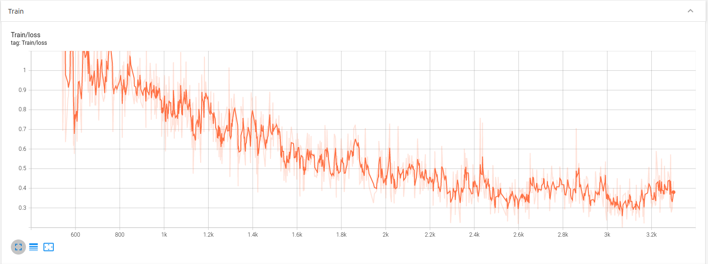
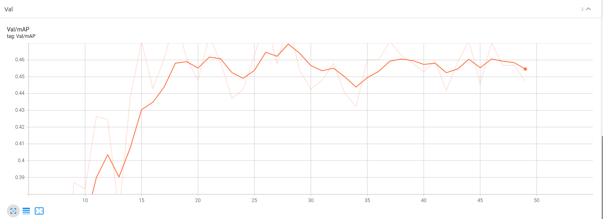
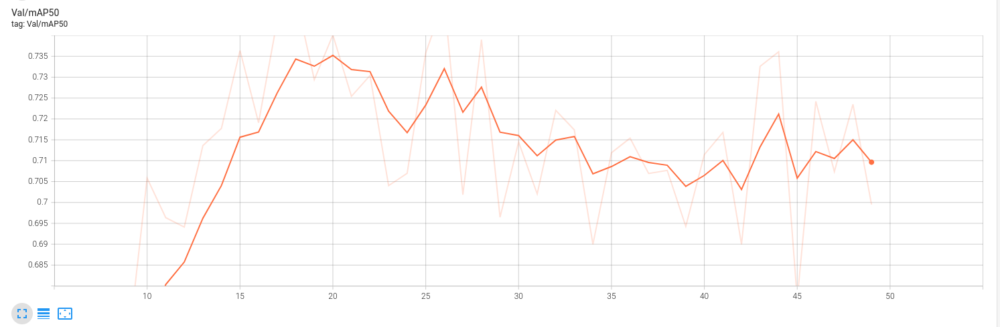
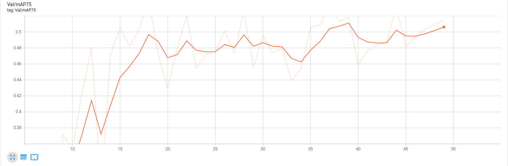

# Tree Detection using Faster R-CNN with MobileNetV3 Large 320 FPN Backbone

This repository contains a project focused on detecting trees within images using the Faster R-CNN model with MobileNetV3 Large 320 FPN backbone. The model has been fine-tuned with `trainable_backbone_layers=5` to enhance its performance specifically for tree detection tasks.

## Overview

Tree detection is crucial for various applications such as forestry management, urban planning, and environmental monitoring. This project aims to provide an accurate and efficient solution for automatically detecting trees within images.

  

<em>Result</em>
 

## Model Details

- **Model Architecture**: Faster R-CNN with MobileNetV3 Large 320 FPN Backbone
- **Trainable Backbone Layers**: 5
- **Input Image Size**: configurable
- **Output**: Bounding boxes around detected trees

## Dataset

The model has been trained on a diverse dataset containing images with annotated bounding boxes around individual trees. The dataset is available [here](https://universe.roboflow.com/yolo-for-tree-detection/tree-detection-ntf74) 

## Performance

- **mAP**: 0.47
- **mAP50**: 0.7
- **mAP75**: 0.5

The model achieved a mean Average Precision (mAP) of 0.47, with mAP50 over 0.7 and mAP75 of 0.5. These values indicate moderate performance overall, with relatively good performance at lower IoU thresholds (mAP50) compared to higher IoU thresholds (mAP75).

## Usage

This model is particularly suitable for machines with limited computational resources. With a RAM capacity of only 4GB, the lightweight MobileNetV3 architecture enables efficient training and inference without overwhelming system resources.

## Installation

To run the detection model, you need the following dependencies:

- Python 3.11
- PyTorch
- Other required libraries 

## Contributing

Contributions to improve the model's performance, add features, or fix issues are welcome. Please fork the repository, make your changes, and submit a pull request detailing your modifications.

## License

This project is licensed under the MIT License - see the [LICENSE](LICENSE) file for details.

## Acknowledgments

Special thanks to the creators and contributors of the TensorFlow Object Detection API, MobileNetV3 architecture, and Faster R-CNN for providing the necessary tools and frameworks to develop this project.

